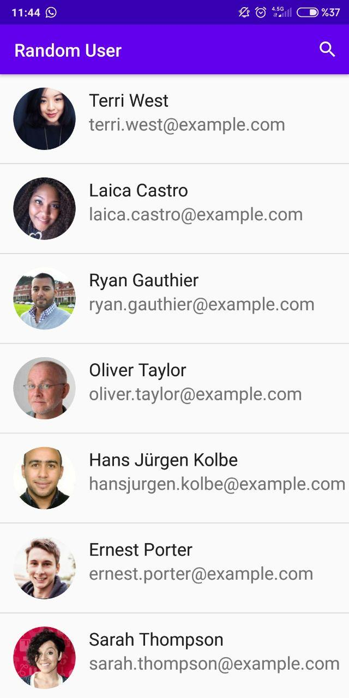
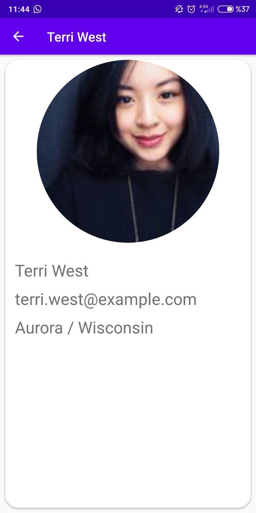

# Random-User-App

Kotlin & Retrofit Random User App

## Application About

- [Kotlin](https://kotlinlang.org/)  
This app generates random user information. 
When the page is refreshed, new users come. 
Search can be made by username. 
You have to tap 2 times to exit the application. 
The cache is cleared when exiting the application.
  - Internet access is needed.
  

### Random User Generator
[Random Api](https://randomuser.me/) a free, open source API for generating random user data. Like Lorem Ipsum, but for people.
  
### Libraries
- [Retrofit2 & OkHttp3](https://github.com/square/retrofit) - construct the REST APIs and paging network data.
- [Gson](https://github.com/google/gson) - Gson is a Java library that can be used to convert Java Objects into their JSON representation.
- [Picasso](https://square.github.io/picasso/) - Images add much-needed context and visual flair to Android applications. Picasso allows for hassle-free image loading in your application—often in one line of code!

